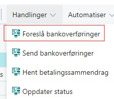

# Forslå bankoverføringer
Denne rutinen benyttes for å foreslå bankoverføringer som skal oversendes banken for utbetaling.
Du kan komme til denne funksjonen enten via køen i rollesentere eller ved å søke etter siden "foreslåtte bankoverføringer".

Fra denne siden sin handlingsmeny finner du så menyvalger "Foreslå betalinger".

